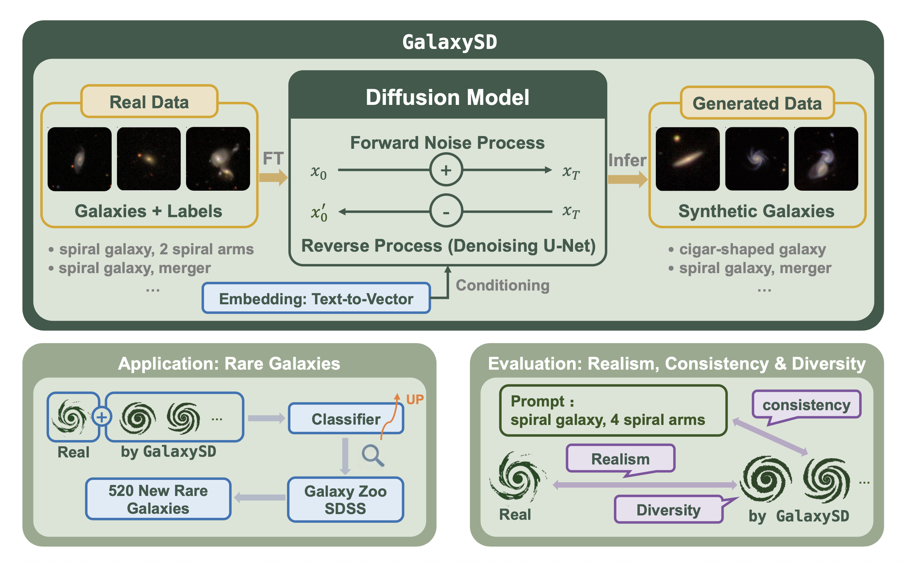

# 🌌 GalaxySD
We fine-tuned sd-1.5 specialized for galaxy image generation by galaxy images with annoted morphological description based on [GZ2](https://arxiv.org/abs/1308.3496v2). The galaxy morphological description dataset in natural language insteal of vote fractions will release soon. 

Our project [HOMEPAGE](https://galaxysd-webpage.streamlit.app/).

### 🧠 Arcitecture

Schematic diagram of our model and downstream tasks in our paper.



### 🛠️ Git and create environment

```
git clone https://github.com/chenruiRae/GalaxySD.git
cd GalaxySD
```

```
conda create -n galaxysd
conda activate galaxysd
pip install -r requirements.txt
```
Now you have set up the workspace and could fine-tune a GalaxySD model. 

### ⚙️ Customize configurations

For example, full fine-tuning training configurations are in `GalaxySD/cfgs/train/examples/fine-tuning_galaxy.yaml`. You could customize it before using. The parameters that must be modified to ensure the pipeline run well and corresponding descriptions in `fine-tuning_galaxy.yaml` are in the following table. The fine-tuning tool we used is [HCP-Diffusion](https://github.com/IrisRainbowNeko/HCP-Diffusion).

| Training Parameter             | Description                                | Example                   |
|--------------------|-------------------------------------|--------------------------|
| `pretrained_model_name_or_path` | Pretrained model name in hugging-face / downloaded local path                | `stable-diffusion-v1-5/stable-diffusion-v1-5` |
| `img_root`    | Image path                              | a folder of `.jpg` files                 |
| `caption_file`       | Caption path                        | a folder of `.txt` files whose filenames are same as corresponding images            |
| `resume` | Continue the previous training by filling this part or start a new training by set it to null                |                       |

By setting these and the rest parameters in configuration, you could start full fine-tuning.

Before inference, you must modify the inference configurations in `GalaxySD/cfgs/infer/text2img_galaxy_full.yaml`.

| Inference Parameter             | Description                                | Example                   |
|--------------------|-------------------------------------|--------------------------|
| `pretrained_model` | Pretrained model name in hugging-face / downloaded local path                | `stable-diffusion-v1-5/stable-diffusion-v1-5` |
| `condition`    | Control the generation                              | `type: i2i`<br>`image: 'galaxy_cond.jpg'`            |

### 🚀 Get started

#### Training
```
bash ./sub_gal_train_full.sh
```
#### Inference
Fill model name and steps and give prompts in `infer_script_full.sh`. You could use the model weights in 🤗[HF](https://huggingface.co/CosmosDream/GalaxySD).
```
bash ./infer_script_full.sh
```
If you wanna view a summary of generation, uncomment the last line of `infer_script_full.sh` and keep the prompts in `create_summary.py` consistent with those in inference script.


### 🔗 Project Resources
- 🏠 [Homepage](https://galaxysd-webpage.streamlit.app/)
- 🤗 [GalaxySD Model Weights](https://huggingface.co/CosmosDream/GalaxySD)
- 🛠️ [Trained Galaxy Embedding Tool](https://huggingface.co/CosmosDream/GalaxyEmb)
- 🗂️ [Training Dataset](https://zenodo.org/records/15669465)
- 📊 [A Contributed Catalog](https://zenodo.org/records/15636756)


### 📄 Citation
```
@article{Ma_2026,
         doi = {10.3847/1538-4365/ae1f10},
         url = {https://doi.org/10.3847/1538-4365/ae1f10},
         year = {2026},
         month = {jan},
         publisher = {The American Astronomical Society},
         volume = {282},
         number = {2},
         pages = {25},
         author = {Ma, Chenrui and Sun, Zechang and Jing, Tao and Cai, Zheng and Ting, Yuan-Sen and Huang, Song and Li, Mingyu},
         title = {Can AI Dream of Unseen Galaxies? Conditional Diffusion Model for Galaxy Morphology Augmentation},
         journal = {The Astrophysical Journal Supplement Series},
}
```

